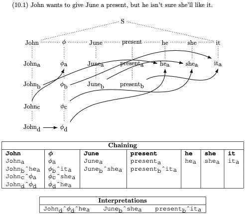

# Pronouns, Second Edition

Kelly Roach  
kellybrianroach@outlook.com  
https://www.kellyroach.com

<p align="center">

</p>

[Pronouns, Second Edition](https://www.planetquantum.com/Papers/Pronouns2Python.pdf)
is a 2024 LaTeX-formatted version of [Kelly Roach](https://www.kellyroach.com)'s original 1980
Caltech M.S. thesis,
[Pronouns](https://authors.library.caltech.edu/records/mf427-dra49). The
content of *Pronouns, Second Edition* is substantially the same
as the original
[Pronouns](https://authors.library.caltech.edu/records/mf427-dra49).

The main functionality focuses on pronoun resolution in English
sentences and documenting these analyses as described in
[Kelly Roach](https://www.kellyroach.com)'s 1980 Caltech M.S. thesis
"Pronouns" (see [Links](#links)).

## Directory Structure

- `.gitignore` - Specifies files ignored by Git
- `LICENSE.md` - Project licensing information [LICENSE.md](LICENSE.md)
- `Makefile` - Used by `make` (see Make Commands below)
- `README.md` - This document
- `assets/` - README.md images
- `docs/` - LaTeX documentation and generated PDFs [(docs/README.md)](docs/README.md)
- `requirements.txt` - Python package dependencies
- `src/` - Python source code [(src/README.md)](src/README.md)
  - `docs/` - Sphinx documentation project [(src/docs/README.md)](src/docs/README.md)
  - `tests/` - Unit tests for the project [(src/tests/README.md)](src/tests/README.md)
    - `expected` - Expected test results [(src/tests/expected/README.md)](src/tests/expected/README.md)
    - `output` - Actual test results [(src/tests/output/README.md)](src/tests/output/README.md)

## Links

- [Kelly Roach](https://www.kellyroach.com)'s Original 1980 Caltech M.S. Thesis: [Pronouns](https://authors.library.caltech.edu/records/mf427-dra49)
- [PDF documentation](docs/Pronouns2Python.pdf)
- [HTML documentation](src/docs/build/html/index.html)
- [Kelly Roach's Pronouns Webpage](https://www.planetquantum.com/Pronouns/Index.htm)

## Software Requirements

### Git Clone

```bash
git clone https://github.com/kellyroach/Pronouns2
```

### Python Requirements
- Python 3.9 or later
- Required packages can be installed using:
  ```bash
  make install   # First-time installation
  make update    # Update existing installation
  ```
  or manually with: 
  ```bash
  pip install -r requirements.txt
  ```

### LaTeX Requirements
See [docs/README.md](docs/README.md) for LaTeX software requirements.

### Git Bash for Windows Users
See [GitBash.md](GitBash.md) for explanation and instructions,
if you are using Microsoft Windows.

## Make Commands

### Root Directory Commands
- `make help`              - Print this help
- `make install`           - Install Python dependencies
- `make update`            - Update Python dependencies
- `make view`              - Build everything; view test coverage, HTML doc, and Demo.pdf

### Build Commands Broadcast to Subdirectories
- `make all`               - Build everything (documentation and run tests)
- `make demos`             - Generate Demo.min, Demo.txt, and Demo.tex
- `make test`              - Run Python unit tests
- `make coverage`          - Run tests with coverage report
- `make html`              - Build HTML documentation
- `make xxx`.pdf           - Generate specific PDF in docs directory
- `make clean`             - Clean intermediate files in all subdirectories
- `make distclean`         - Remove all non-shipping generated files
- `make maintainer-clean`  - Remove all generated files for a pristine state

See individual subdirectory README.md files for more detailed make commands available in each directory.

## Quick Start

```bash
# As a module in Python REPL
$ cd src && python
>>> from pronouns2 import *
>>> demo("10.1")                    # Run specific demo
>>> demo()                          # Run all demos
>>> doc(file_type=FileType.TXT)     # Generate docs/Demo.txt
>>> doc(file_type=FileType.TEX)     # Generate docs/Demo.tex
>>> example("10.1")                 # See example (10.1)

# As a command-line tool
$ cd src && python pronouns2.py --info     # Analyze all examples
Created: .../docs/Demo.tex
$ cd src && python pronouns2.py --file_type=.txt --info     # TXT version
Created: .../docs/Demo.txt
$ cd src && python pronouns2.py "10.1" --file=../docs/Demo_10p1 --info     # Example (10.1)
Created: .../docs/Demo_10p1.tex
$ cd src && python pronouns2.py --file=../docs/Demo_debug --info --debug     # More detail
Created: .../docs/Demo.tex
$ cd src && python pronouns2.py "10.1" --file=../docs/Demo_10p1_debug --info --debug
Created: .../docs/Demo_10p1.tex
$ cd src && python pronouns2.py --file=../docs/Demo_trace --info --debug --trace
Created: .../docs/Demo_trace.tex
$ cd src && python pronouns2.py "10.1" --file=../docs/Demo_10p1_trace --info --debug --trace
Created: .../docs/Demo_10p1_trace.tex
$ cd docs && make all && make clean     # Create new/updated PDFs in docs directory
...

# Print root directory's make's help
$ make help
# Build everything (documentation and run tests)
$ make all
# Build everything, view test coverage, HTML doc, and Demo.pdf
$ make view
# Read [Kelly Roach](https://www.kellyroach.com)'s "Pronouns, Second Edition (Python Version)"
$ open docs/Pronouns2Python.pdf
# Read HTML documentation
$ open src/docs/build/html/index.htm

# Run unit tests
$ cd src && make coverage; open htmlcov/index.html
# OR
$ cd src/tests; make coverage
# OR also with PDFs created in src/tests/output
$ cd src/tests; make coverage; make output-pdfs

# Remove files most humans don't want to see
$ make clean
```
See [Usage](src/docs/build/html/usage.htm) for further examples.

## Chatbot Assistance

I have received considerable help from two AI chatbots

- [Claude 3.5 Sonnet](https://www.anthropic.com/claude/sonnet)
- [ChatGPT 4o](https://openai.com/index/gpt-4o-and-more-tools-to-chatgpt-free/)

with respect to

* Conversion of Modula-2 code to Python code
* Instruction in advanced Python such as
  `@classmethod`, `@property`, `@staticmethod`, `__repr__`,
  `__str__`, `with/__enter__/__exit__`, `__init__.py`,
  `def main()/argparse`
* Automatically generating Google-style Python docstrings
* Initial Python unit test directory configuration and subsequent
  creation of many (not all) unit tests
* First pass at creating Spreading Algorithm code from English specification
* Coding `tex_escape_str` and `find_files`
* Help refactoring, completing, fixing, upgrading Python code
* Sphinx `conf.py` setup adjustments for Sphinx automated HTML
  documentation generation
* Reading code and suggesting useful questions for `faq.rst`
* First attempts at generating LaTeX Tikz diagrams nearly replicating
  1980 figures
* Explaining the mysteries of `TEXINPUTS` and `BIBINPUTS`
* First pass proposal for repo directory structure given English
  specification requirements
* Assistance creating comprehensive `.gitignore` and `.gitignore_global`
* First pass creation of project Makefile's from English specifications
  and additional subsequent improvements
* Initial (approx 35) suggestions for [RelatedLiterature.pdf](docs/RelatedLiterature.pdf)
* Help creating README.md's
* Assistance choosing Git Bash and creating GitBash.md

Occasionally, I've had to **fire** some AI chatbots, which I
would **rehire** back again days later.  AI chatbots have been
junior partners on the team.  I have been the architect and lead
software engineer.
