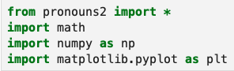
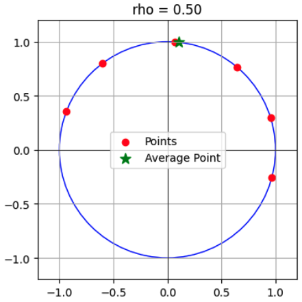

# src Directory

The `src` directory contains the Python source code and tests
for the project.

## Directory Structure

- `Makefile` - Used by `make` utility
- `README.md` - This document
- `.coverage` - coverage raw data from test runs (SQLite)
- `.coveragerc` - coverage configuration (text)
- `*.py` - Python source code
- `spread.ipynb` - Jupyter notebook
- `docs/` - Sphinx project
- `htmlcov/` - HTML coverage test report directory generated by `make coverage`
  - `*.html`, `*.css`, `*.js`, `*.png` - HTML coverage test report files
- `tests/` - Unit tests
  - `expected/` - Expected *.txt, *.tex, and *.pdf files
  - `output/` - Output *.txt, *.tex, and *.pdf files
  - `utils/` - Unit test utilities

## Sphinx Generated Documentation

- [HTML documentation](src/docs/build/html/index.htm)

## Python Source Code

### pronouns2.py

Main entry point for demos and analysis file generation. It
can be used both as a Python module and as a command-line tool:

```bash
"""Main project Python module to import which imports everything else."""

def main():
    """Main entry point for the pronouns2.py command-line tool.

    Supports the following commands:
    - Run a specific demo: $ python pronouns2.py --demo "10.1"
    - Run all demos: $ python pronouns2.py --demo-all
    - Generate documentation in plain text: $ python pronouns2.py --doc txt
    - Generate documentation in LaTeX format: $ python pronouns2.py --doc tex

    Parses command-line arguments, executes the corresponding functionality,
    and prints results or generates documentation files in the specified format.

    Raises:
        ValueError: If invalid arguments are provided.
        IOError: If there is an issue writing documentation files.
    """
```

See [pronouns2.py](./pronouns2.py) and [**Quick Start**](#quick-start) below.

### doc.py

```bash
def doc(numbers = None, file: str = "../docs/Demo", **kwargs) -> str:
    """Output file containing example sentences with their analyses.

    Args:
        numbers (optional): None, str, or list[str] of keys in example_dict
        file (str, optional): File name. Defaults to "../docs/Demo".
        kwargs: other key-value arguments accepted by Manager.set_state

    Returns:
        str: The full path to the generated file.
    """
```

See [doc.py](./doc.py).

### demo.py

```bash
def demo(numbers = None, **kwargs):
    """Runs demo_example() on all examples in numbers sequentially.

    Args:
        numbers (optional): None, str, or list[str] of keys in example_dict
        kwargs: other key-value arguments accepted by Manager.set_state
    """
```

```bash
def demo_example(number: str, **kwargs):
    """Processes and displays analysis of a single example
    sentence, showing parse tree structure, features, nodes,
    chains, and interpretations.

    Args:
        number (str): Example sentence identifier in example_dict
        kwargs: other key-value arguments accepted by Manager.set_state
    """
```

See [demo.py](./demo.py).

### globals.py

```bash
class Manager:
    """A singleton class for managing output streams and file types."""
    def __init__(self):
    def __init__(self):
        self.state = {'stream': sys.stdout,
                      'file_type': FileType.TXT,
                      'info': True,
                      'features_table': True,
                      'abstract_diagram': True,
                      'nodes_after_chaining': True,
                      'nodes_table': True,
                      'chaining_diagram': True,
                      'chaining_rho': 0.5,
                      'chaining_table': True,
                      'interpretations_table': True,
                      'summary_table': True,
                      'lexicon_table': True,
                      'debug': False,
                      'nodes_after_parse': True,
                      'init_table': True,
                      'new_chain': True,
                      'trace': False}
        self.state_stack = []
    ...
```

See [globals.py](./globals.py).

### examples.py

```bash
example_dict = {
    "10.1":
     ["John wants to give June a present, but he isn't sure she’ll like it.",
      ["C",
       ["S", "John", ["S", "PHI", "June", "present"]],
       ["S", "he", ["S", "she", "it"]]]],
    ...
}
```

See [examples.py](./examples.py).

### Module Dependencies

The Module Dependencies amongst all the Python modules in the
Pronouns2 project are captured by a block comment in the
[pronouns2.py](./pronouns2.py) source code.  Click the
[pronouns2.py](./pronouns2.py) link if you want to see the
Module Dependencies.

## Quick Start

```bash
# As a module in Python REPL
$ python
>>> from pronouns2 import *
>>> demo("10.1")                    # Run specific demo
>>> demo()                      # Run all demos
>>> doc(file_type=FileType.TXT)     # Generate docs/Demo.txt
>>> doc(file_type=FileType.TEX)     # Generate docs/Demo.tex
>>> example("10.1")                 # See example (10.1)

# As a command-line tool
$ python pronouns2.py --info     # Analyze all examples
Created: .../docs/Demo.tex
$ python pronouns2.py --file_type=.txt --info     # TXT version
Created: .../docs/Demo.txt
$ python pronouns2.py "10.1" --file=../docs/Demo_10p1 --info     # Example (10.1)
Created: .../docs/Demo_10p1.tex
$ python pronouns2.py --file=../docs/Demo_debug --info --debug     # More detail
Created: .../docs/Demo.tex
$ python pronouns2.py "10.1" --file=../docs/Demo_10p1_debug --info --debug
Created: .../docs/Demo_10p1.tex
$ python pronouns2.py --file=../docs/Demo_trace --info --debug --trace
Created: .../docs/Demo_trace.tex
$ python pronouns2.py "10.1" --file=../docs/Demo_10p1_trace --info --debug --trace
Created: .../docs/Demo_10p1_trace.tex
$ cd ../docs && make all && make clean     # Create new/updated PDFs in docs directory
...

# Print src directory's make's help
$ make help
# Run tests and generate analysis files
$ make all
# Make all. View test coverage
$ make view
# Read HTML documentation
$ open docs/build/html/index.htm

# Run unit tests
$ make coverage; open htmlcov/index.html
# OR
$ cd tests; make coverage
# OR also with PDFs created in tests/output
$ cd tests; make coverage; make output-pdfs

# Remove files most humans don't want to see
$ make clean
```

See [Usage](docs/build/html/usage.htm) for further examples.

## Jupyter Notebook

Jupyter notebook `spread.ipynb` is a freebie which isn't
essential to running the Pronouns2 Python code.  However, it can
provide insight into how our Spreading Algorithm [spread.py](./spread.py)
helps to draw Pronouns2's pretty Tikz chaining diagrams.

* Connect to `src` directory in Terminal.app
* Execute `jupyter notebook`
* In Jupyter notebook, running in your web browser, doubleclick
  `spread.ipynb` in the `Files` tab.
* Press `Restart the kernel and run all the cells` button
  
  in opened `spread.ipynb` Jupyter notebook.
* The `spread.ipynb` Jupyter notebook imports `pronouns2`:

  <p align="center">
    
  </p>
  
  and runs Python code in all the Jupyter notebook cells,
  creating many plots like:
  
  <p align="center">
    
  </p>

  demonstrating the Spreading Algorithm.  Our document
  [VaryingRho.pdf](../docs/VaryingRho.pdf) goes into greater
  detail about how this algorithm is used to tune the placement
  of arrowheads in Pronouns2's Tikz chaining diagrams.

## Make Commands

The following make targets are available:

- `make help`              - Print this help
- `make all`               - Run tests and generate analysis files
- `make view`              - Build everything; view test coverage
- `make demos`             - Generate `../docs/Demo.txt` and `../docs/Demo.tex`
- `make demo-txt`          - Generate `../docs/Demo.txt`
- `make demo-tex`          - Generate `../docs/Demo.tex`
- `make test`              - Run unit tests
- `make coverage`          - Run tests with coverage and generate `htmlcov/index.html`
- `make clean`             - Remove intermediate files
- `make distclean`         - Remove all non-distributed files
- `make maintainer-clean`  - Remove all generated files for a pristine state
